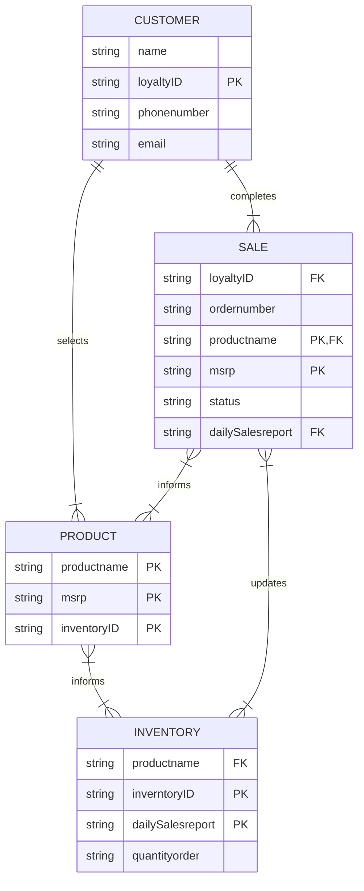

## Lesson 2 - Entity Relationship Diagram \(ERD\)rendered in Mermaid

### Scenario 3: Nike shoe store ERD

### Description of Diagram

In the *Entity Relationship Diagram* above you see the relationships between **CUSTOMER**, **SALES**, **PRODUCT**, and **INVENTORY**.

* __CUSTOMER__ has been defined as a person\(s\) who has entered the store with the intent to purchase at least one __PRODUCT__.
* __SALES__ has been defined as a transaction initiated by __CUSTOMER__.
* __PRODUCT__ has been defined as __inventoried__ items for sale, including items not currently available at the store.
* __INVENTORY__ has been defined as the collection of __PRODUCT__ and the accounting of such items.

In this diagram, the __CUSTOMER__ sits at the top indicating in this relationship analysis __CUSTOMER__ begins the process.  
The __CUSTOMER__ selecting the __PRODUCT__ and completing a __SALE__, the events lead to both __PRODUCT__ and __SALES__ entities to update __INVENTORY__.  
The flow of these entities into one another ensures the maximum benefit to each entity and therefore to the STORE as a whole.  

An example: If __SALES__ does not update __INVENTORY__ after each transaction with accurate *productname* and *dailySalesreport*, then when employees inquire about items the __INVENTORY__ will be incorrect and the amount of __PRODUCT__ ordered to replace that sold will also be incorrect. This confusion leads to upset __CUSTOMERS__ and less sales.

